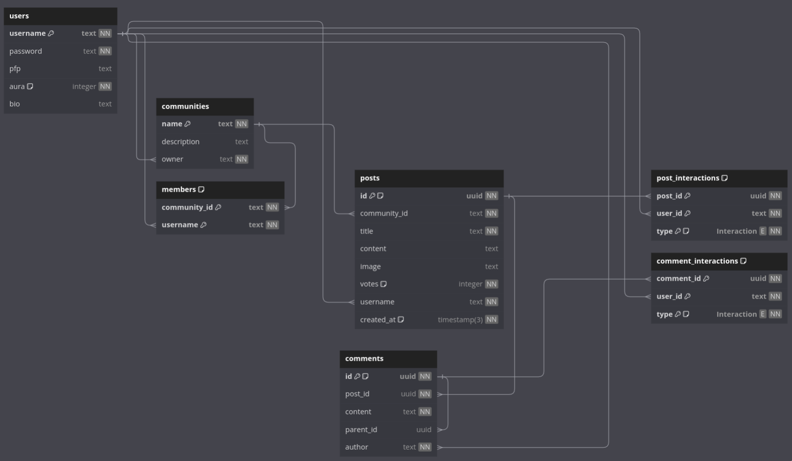

# Aurbit

Aurbit is a (almost) fully functional clone of Reddit.

# Technology choices
1. Frontend : HTMX
2. Backend : ExpressJS
3. Database : PostgresSQL
4. ORM : Kysely 

# Database schema
1. The users table stores data regarding the users
```prisma
model users {
  username String  @id
  password String
  pfp      String?
  aura     Int     @default(0)
  bio      String?

  joined               members[]
  posts                posts[]
  communities          communities[]
  comments             comments[]
  post_interactions    post_interactions[]
  comment_interactions comment_interactions[]
}
```

- `username` is the primary key of the table.
- `password` is the hashed password of the user (Hashed using bcrypt)
- `pfp` profile picture link
- `aura` karma points of the user (not yet implemented)
- `bio` bio of the user


2. Communities table
```prisma
model communities {
  name        String  @id
  description String?
  owner       String

  user    users     @relation(fields: [owner], references: [username])
  posts   posts[]
  members members[]
}
```
- `name` is name of the community and its the primary key.
- `description` description
- `owner` is the username of the owner of the community, its tied to the users table so that it will be easy to query owner details and the communities owned by the user.


3. Posts table
```prisma
model posts {
  id           String   @id @default(dbgenerated("gen_random_uuid()")) @db.Uuid
  community_id String
  username     String
  title        String
  votes        Int      @default(0)
  content      String?
  image        String?
  created_at   DateTime @default(now())

  user        users               @relation(fields: [username], references: [username])
  community   communities         @relation(fields: [community_id], references: [name])
  comments    comments[]
  interaction post_interactions[]
}
```

- `id` UUID generated by the database.
- `community_id` foreign key to the communities table, name of the community.
- `username` username of the user who posted the post, its tied to the users table.
- `title` title of the post.
- `votes` number of votes the post has.
- `content` content of the post.
- `image` image of the post. (not implemented yet)
- `created_at` timestamp of the post creation, default is the current timestamp.

I think keeping `id` as the snake case of `title` would have improved the SEO of the post, since the url for a post goes like `/posts/<post_id>`. But UUIDs were much simpler to implement.

The votes field is more of a metadata than a actual vote count. The actual vote count is calculated by the `post_interactions` table. It is seperate table because it enables me to query and show upvoted and downvoted posts of the user just like if you go to your profile page in Reddit and click on "Upvoted" section.

Since interactions are a seperate table now, it will be very expensive to query the upvote and downvote details for every post and show it in the frontend, due to the tables having to do expensive joins.

4. Members table
```prisma
model members {
  community_id String
  username     String

  user      users       @relation(fields: [username], references: [username])
  community communities @relation(fields: [community_id], references: [name])

  @@id([username, community_id])
}
```

- `community_id` - Linked to the communities table to so that its easier to query members details
- `username` - Linked to the users table


5. Comments table
```prisma
model comments {
  id        String  @id @default(dbgenerated("gen_random_uuid()")) @db.Uuid
  post_id   String  @db.Uuid
  content   String
  parent_id String? @db.Uuid
  author    String

  parent               comments?              @relation(name: "parent", fields: [parent_id], references: [id])
  posts                posts                  @relation(fields: [post_id], references: [id])
  children             comments[]             @relation(name: "parent")
  users                users?                 @relation(fields: [author], references: [username])
  comment_interactions comment_interactions[]
}
```

- `id` - UUID generated by the database
- `post_id` - Post ID of the post this comment was placed on
- `content` - Content of the comment
- `parent_id` - This field is used for replies
- `author` - The user who left the comment

When the parent_id is NULL, then that means the comment was left on the post. If a comment had a parent_id, that means this comment was left by replying to the comment with the mentioned parent_id. This enables replying to comments.

6. Interactions
```prisma
enum Interaction {
  UPVOTE
  DOWNVOTE
}

model post_interactions {
  post_id String      @db.Uuid
  user_id String
  type    Interaction

  posts posts @relation(fields: [post_id], references: [id])
  users users @relation(fields: [user_id], references: [username])

  @@id([post_id, user_id])
}

model comment_interactions {
  comment_id String      @db.Uuid
  user_id    String
  type       Interaction

  comments comments @relation(fields: [comment_id], references: [id])
  users    users    @relation(fields: [user_id], references: [username])

  @@id([comment_id, user_id])
}
```

The table here is splitted into 2 tables, One for interactions on posts and another one is interactions on comments. I first thought of keeping both in the same table, but if that happened, then it means I had to keep one column as NULL for every record. Because if the interaction was for a post, then the post_id will be populated, but the comment_id will be NULL and vice versa. 

I am not sure if using the same table was a better solution, or keeping it seperate. 

## The entire database diagram



Used [dbdiagram.io](https://dbdiagram.io) For creating the above diagram

---

# API Documentation

The API for this projects starts with `/api`. It tries to follow all RESTful API standards. I also tried to make it as much self discoverable as possible. The endpoints marked with `(A)` are authenticated endpoints.

### /login
- `GET /login` - It retrieves the login html component
- `POST /login` - Its used to login a user

### /signup
- `GET /signup` - It retrieves the signup html component
- `POST /signup` - Its used to signup a user

### /interfaces
The interfaces are user interactive components like navbar, sidebar etc. I used this to keep the code as DRY as possible, since there are no reusable components like react components in this project.

- `GET /interfaces/navbar` - It retrieves the navbar html component
- `GET /interfaces/sidebar` - It retrieves the sidebar html component 

### /posts
- `GET /posts` - It retrieves posts 
- `POST /posts` - It creates a post (A)
- `GET /posts/:id/comments` - It retrieves the root comments of a post
- `POST /posts/:id/comments` - Adds a new root comment to the post (A)
- `POST /posts/:id/upvote` - Upvotes a post (A)
- `POST /posts/:id/downvote` - Downvotes a post (A)

### /comminity
- `POST /community/new` - It creates a community (A)

### /comments
- `GET /comments/:id/replies` - Fetches the replies of a comment
- `POST /comments/:id/replies` - Posts a reply to a comment (A)
- `POST /comments/:id/upvote` - Upvotes a comment (A)
- `POST /comments/:id/downvote` - Downvotes a comment (A)